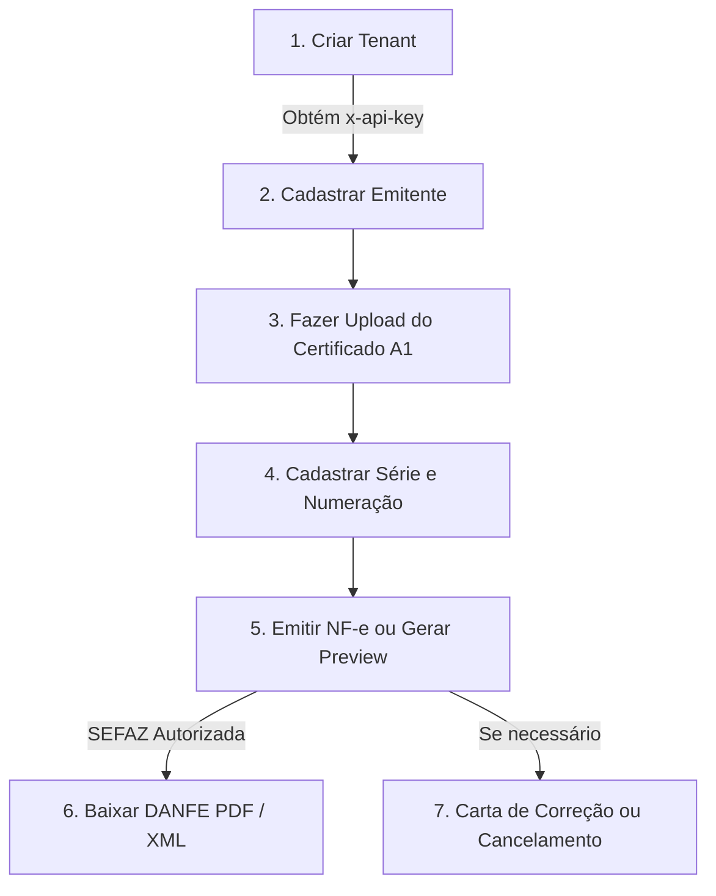

# 🚀 Emissor NF-e Gateway

Gateway Multi-tenant de Emissão e Gestão de Notas Fiscais Eletrônicas (**NF-e - Modelo 55**) e Eventos Fiscais, desenvolvido com **NestJS**, **TypeScript**, **TypeORM** e **PostgreSQL**.

---

## 📋 Sumário

- [Visão Geral](#-visão-geral)
- [Funcionalidades](#-funcionalidades)
- [Tecnologias Utilizadas](#-tecnologias-utilizadas)
- [Arquitetura de Segurança e Autenticação](#-arquitetura-de-segurança-e-autenticação)
- [Pré-requisitos](#-pré-requisitos)
- [Instalação e Execução](#-instalação-e-execução)
- [Variáveis de Ambiente](#-variáveis-de-ambiente)
- [Fluxo Operacional de Emissão](#-fluxo-operacional-de-emissão)
- [Referência da API (Endpoints)](#-referência-da-api-endpoints)
- [Coleção de Testes (Bruno)](#-coleção-de-testes-bruno)
- [Estrutura do Projeto](#-estrutura-do-projeto)
- [Scripts Disponíveis](#-scripts-disponíveis)

---

## 🌟 Visão Geral

O **Emissor NF-e Gateway** atua como uma camada intermediária simplificada entre sistemas corporativos/ERPs e os webservices da **SEFAZ**. Ele abstrai a complexidade de assinatura digital XML, envelopamento SOAP, controle transacional de numeração fiscal, guarda de certificados A1 criptografados e disparo de webhooks de notificação.

---

## ✨ Funcionalidades

- **Isolamento Multi-tenant**: Cada tenant possui suas próprias credenciais, emitentes, certificados e histórico fiscal.
- **Gestão de Emitentes**: Cadastro completo de emitentes (dados cadastrais, CNPJ/CPF, Inscrição Estadual, CNAE, Regime Tributário CRT).
- **Gestão Segura de Certificados Digitais A1**:
  - Upload de certificados `.pfx` / `.p12` codificados em Base64.
  - Criptografia simétrica com chave mestra no banco de dados.
  - Validação de expiração e extração de dados do certificado X.509.
- **Controle Concorrente de Séries e Numeração**:
  - Auto-incremento sequencial por emitente, modelo e série.
  - Bloqueio pessimista para evitar duplicidade ou pulo de numeração.
  - Endpoint de sincronização manual com a última numeração emitida na SEFAZ.
- **Emissão e Transmissão de NF-e (Modelo 55)**:
  - Montagem e validação do XML de NF-e (layout 4.00).
  - Assinatura digital do lote/XML usando o certificado A1.
  - Comunicação síncrona/assíncrona com os webservices da SEFAZ.
- **Preview e Geração de DANFE (PDF)**:
  - Geração de DANFE em PDF do XML autorizado.
  - Endpoint para **Preview de DANFE** antes do envio para a SEFAZ.
  - Download do XML autorizado / cancelado.
- **Eventos Fiscais**:
  - Cancelamento de NF-e com justificativa.
  - Carta de Correção Eletrônica (CC-e).
- **Monitoramento SEFAZ**: Consulta em tempo real do status de serviço dos servidores da SEFAZ por UF.
- **Webhooks**: Registro e notificação assíncrona para sistemas parceiros com logs de entrega.

---

## 🛠 Tecnologias Utilizadas

- **Runtime & Framework**: [Node.js](https://nodejs.org/) (v20+) & [NestJS 10](https://nestjs.com/)
- **Linguagem**: [TypeScript](https://www.typescriptlang.org/)
- **Banco de Dados**: [PostgreSQL 16](https://www.postgresql.org/)
- **ORM**: [TypeORM 0.3](https://typeorm.io/)
- **Criptografia e Certificados**: [node-forge](https://github.com/digitalbazaar/forge)
- **Manipulação XML**: [fast-xml-parser](https://github.com/NaturalIntelligence/fast-xml-parser)
- **Geração de DANFE**: [nfe-danfe-pdf](https://www.npmjs.com/package/nfe-danfe-pdf)
- **HTTP Client**: [Axios](https://axios-http.com/)
- **Containerização**: [Docker](https://www.docker.com/) & [Docker Compose](https://docs.docker.com/compose/)
- **API Testing**: [Bruno](https://www.usebruno.com/)

---

## 🔐 Arquitetura de Segurança e Autenticação

A API adota um esquema de autenticação em duas camadas via headers HTTP:

| Nível | Header | Descrição | Utilizado em |
|---|---|---|---|
| **Admin** | `x-admin-key` | Chave mestra administrativa configurada na variável `ADMIN_API_KEY`. | Endpoints `/api/v1/tenants` |
| **Tenant** | `x-api-key` | Chave de API única gerada na criação do Tenant (armazenada de forma segura). O gateway identifica o tenant automaticamente pela chave. | Todos os endpoints operacionais (`/emitentes`, `/certificados`, `/nfe`, etc.) |

---

## 📦 Pré-requisitos

- [Node.js](https://nodejs.org/) (versão 20 ou superior)
- [npm](https://www.npmjs.com/) ou [pnpm](https://pnpm.io/)
- [Docker](https://www.docker.com/) e [Docker Compose](https://docs.docker.com/compose/) (para o banco de dados PostgreSQL)
- Certificado Digital A1 no formato `.pfx` ou `.p12` (para emissão e testes junto à SEFAZ)

---

## 🚀 Instalação e Execução

### 1. Clonar o Repositório

```bash
git clone <url-do-repositorio>
cd emissor-nfe
```

### 2. Instalar as Dependências

```bash
npm install
```

### 3. Configurar as Variáveis de Ambiente

Copie o arquivo de exemplo e ajuste os parâmetros conforme necessário:

```bash
cp .env.example .env
```

### 4. Iniciar o Banco de Dados com Docker

Suba o container do PostgreSQL:

```bash
docker compose up -d
```

### 5. Iniciar a Aplicação em Modo Desenvolvimento

```bash
npm run start:dev
```

A API estará acessível em: `http://localhost:3000/api/v1`

---

## ⚙️ Variáveis de Ambiente

| Variável | Descrição | Exemplo / Padrão |
|---|---|---|
| `PORT` | Porta onde a aplicação NestJS irá rodar | `3000` |
| `NODE_ENV` | Ambiente de execução (`development`, `production`) | `development` |
| `ADMIN_API_KEY` | Chave mestra para gestão administrativa de tenants | `admin-super-secret-key` |
| `DB_HOST` | Host do banco PostgreSQL | `localhost` |
| `DB_PORT` | Porta exposta do PostgreSQL | `5434` (mapeada no Docker para 5432) |
| `DB_USER` | Usuário do banco de dados | `postgres` |
| `DB_PASS` | Senha do banco de dados | `postgres123` |
| `DB_NAME` | Nome da base de dados | `emissor_nfe_db` |
| `DB_LOGGING` | Habilita logs de queries do TypeORM | `true` |
| `DB_SYNCHRONIZE` | Sincronização automática de schema (desativar em produção) | `true` |
| `ENCRYPTION_KEY` | Chave de criptografia simétrica para certificados A1 (mínimo 32 caracteres) | `supersecretkey32charactersminimum!` |
| `SEFAZ_FORCE_HOMOLOGACAO` | Se `true`, força chamadas ao ambiente de homologação (2) | `true` |
| `SEFAZ_DEFAULT_AMBIENTE` | Ambiente padrão da SEFAZ (`1` = Produção, `2` = Homologação) | `2` |

---

## 🔄 Fluxo Operacional de Emissão

Para começar a emitir notas fiscais pelo gateway:



1. **Criar Tenant**: Com o header `x-admin-key`, execute `POST /api/v1/tenants`. Guarde a `apiKey` retornada.
2. **Cadastrar Emitente**: Com `x-api-key`, envie os dados fiscais da empresa em `POST /api/v1/emitentes`.
3. **Upload do Certificado**: Converta o arquivo `.pfx` em Base64 e faça upload com a senha em `POST /api/v1/certificados/upload`.
4. **Configurar Série**: Defina a numeração inicial da série fiscal em `POST /api/v1/series-numeracao`.
5. **Emitir NF-e**: Envie os dados da nota em `POST /api/v1/nfe/emitir`.
6. **Obter DANFE / XML**: Realize o download do PDF em `GET /api/v1/nfe/:id/danfe` ou XML em `GET /api/v1/nfe/:id/xml`.

---

## 📡 Referência da API (Endpoints)

Prefixo global: `/api/v1`

### 🏥 Health Check

| Método | Rota | Autenticação | Descrição |
|---|---|---|---|
| `GET` | `/api/v1` | Pública | Retorna o status operacional e catálogo de rotas |

### 🏢 Tenants (Administrativo)

| Método | Rota | Autenticação | Descrição |
|---|---|---|---|
| `POST` | `/api/v1/tenants` | `x-admin-key` | Cria um novo tenant e retorna a API Key gerada |
| `GET` | `/api/v1/tenants` | `x-admin-key` | Lista todos os tenants cadastrados |
| `GET` | `/api/v1/tenants/:id` | `x-admin-key` | Busca tenant por ID |

### 🏭 Emitentes

| Método | Rota | Autenticação | Descrição |
|---|---|---|---|
| `POST` | `/api/v1/emitentes` | `x-api-key` | Cadastra um novo emitente associado ao tenant |
| `GET` | `/api/v1/emitentes` | `x-api-key` | Lista os emitentes do tenant |
| `GET` | `/api/v1/emitentes/atual` | `x-api-key` | Retorna o emitente principal do tenant |
| `GET` | `/api/v1/emitentes/:id` | `x-api-key` | Detalhes de um emitente por ID |
| `PUT` | `/api/v1/emitentes/:id` | `x-api-key` | Atualiza dados cadastrais do emitente |

### 🔐 Certificados Digitais

| Método | Rota | Autenticação | Descrição |
|---|---|---|---|
| `POST` | `/api/v1/certificados/upload` | `x-api-key` | Upload de certificado A1 (`.pfx` em Base64 + senha) |
| `GET` | `/api/v1/certificados/:emitenteId` | `x-api-key` | Consulta metadados e validade do certificado |

### 🔢 Séries e Numeração

| Método | Rota | Autenticação | Descrição |
|---|---|---|---|
| `POST` | `/api/v1/series-numeracao` | `x-api-key` | Cria configuração de série fiscal |
| `GET` | `/api/v1/series-numeracao/:emitenteId` | `x-api-key` | Lista séries cadastradas para o emitente |
| `POST` | `/api/v1/series-numeracao/:emitenteId/sincronizar-numero` | `x-api-key` | Sincroniza/atualiza o último número da série |

### 📄 Notas Fiscais (NF-e)

| Método | Rota | Autenticação | Descrição |
|---|---|---|---|
| `POST` | `/api/v1/nfe/emitir` | `x-api-key` | Valida, assina, numera e transmite a NF-e à SEFAZ |
| `POST` | `/api/v1/nfe/preview-danfe` | `x-api-key` | Retorna o stream do PDF de visualização prévia da DANFE |
| `GET` | `/api/v1/nfe/:id/danfe` | `x-api-key` | Retorna o stream do PDF oficial da DANFE autorizada |
| `GET` | `/api/v1/nfe/:id/xml` | `x-api-key` | Download do XML assinado/processado |
| `POST` | `/api/v1/nfe/:id/cancelar` | `x-api-key` | Envia evento de cancelamento da NF-e para a SEFAZ |
| `POST` | `/api/v1/nfe/:id/carta-correcao` | `x-api-key` | Envia Carta de Correção Eletrônica (CC-e) |
| `GET` | `/api/v1/nfe/:id` | `x-api-key` | Busca NF-e por ID |
| `GET` | `/api/v1/nfe/chave/:chaveAcesso` | `x-api-key` | Busca NF-e pela Chave de Acesso (44 dígitos) |
| `GET` | `/api/v1/nfe` | `x-api-key` | Lista todas as notas fiscais do tenant |

### ⚡ Eventos Fiscais

| Método | Rota | Autenticação | Descrição |
|---|---|---|---|
| `POST` | `/api/v1/eventos-fiscais` | `x-api-key` | Registra e transmite um evento fiscal genérico |
| `GET` | `/api/v1/eventos-fiscais/nota/:notaFiscalId` | `x-api-key` | Lista eventos vinculados a uma nota fiscal |

### 🌐 SEFAZ

| Método | Rota | Autenticação | Descrição |
|---|---|---|---|
| `GET` | `/api/v1/sefaz/status/:emitenteId` | `x-api-key` | Consulta o status operacional do webservice da UF do emitente |

### 🪝 Webhooks

| Método | Rota | Autenticação | Descrição |
|---|---|---|---|
| `GET` | `/api/v1/webhooks/logs` | `x-api-key` | Histórico e status de entrega dos disparos de webhooks |

---

## 🧪 Coleção de Testes (Bruno)

O projeto inclui uma coleção completa de testes pronta para o cliente HTTP **[Bruno](https://www.usebruno.com/)** na pasta `bruno/`.

### Como utilizar:
1. Abra o Bruno e selecione **Open Collection** apontando para a pasta `bruno/`.
2. Configure o arquivo `bruno/.env` com a sua `ADMIN_API_KEY`.
3. Selecione o ambiente **Local**.
4. Execute as requisições sequencialmente ou via CLI:

```bash
cd bruno
npx @usebruno/cli run --env Local
```

Para mais detalhes sobre conversão de certificados para Base64 e variáveis, consulte o [README do Bruno](bruno/README.md).

---

## 📂 Estrutura do Projeto

```text
emissor-nfe/
├── bruno/                      # Coleção de testes de API do Bruno
├── docker-compose.yml          # Definição do container PostgreSQL
├── package.json                # Dependências e scripts do projeto
├── src/
│   ├── app.controller.ts       # Healthcheck e endpoints raiz
│   ├── app.module.ts           # Módulo principal da aplicação
│   ├── main.ts                 # Bootstrap e configurações globais (CORS, Pipes)
│   ├── common/                 # Guardas de autenticação, decorators e utilitários
│   │   ├── decorators/
│   │   └── guards/             # AdminGuard (x-admin-key) e ApiKeyGuard (x-api-key)
│   ├── config/                 # Configurações do TypeORM e DataSource
│   └── modules/                # Módulos de domínio
│       ├── certificado/        # Criptografia e gestão de certificados A1
│       ├── emitente/           # Gestão de dados dos emitentes
│       ├── evento-fiscal/      # Registro de eventos SEFAZ (Cancelamento, CC-e)
│       ├── nota-fiscal/        # Emissão, geração de XML, DANFE e persistência
│       ├── sefaz/              # Comunicação e status com os webservices SEFAZ
│       ├── serie-numeracao/    # Controle concorrente de séries fiscais
│       ├── tenant/             # Gestão de tenants e chaves de API
│       └── webhook/            # Disparo e logs de notificações assíncronas
```

---

## 📜 Scripts Disponíveis

| Comando | Descrição |
|---|---|
| `npm run start:dev` | Inicia o servidor em modo de desenvolvimento com hot-reload |
| `npm run build` | Compila o projeto TypeScript para JavaScript na pasta `dist/` |
| `npm run start:prod` | Executa a versão compilada em produção (`node dist/main`) |
| `npm run format` | Executa o Prettier para padronização do código-fonte |
| `npm run migration:generate` | Gera uma nova migration baseada nas alterações das entidades |
| `npm run migration:run` | Aplica as migrations pendentes no banco de dados |
| `npm run migration:revert` | Reverte a última migration executada |

---

## 📄 Licença

Este projeto é privado e de uso exclusivo sob licença **MIT**.
